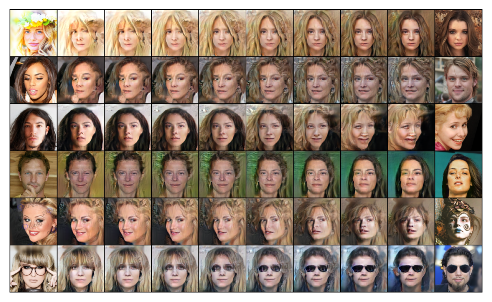

# IntroVAE

Introspective variational autoencoder (introduced by [Huang et al](https://arxiv.org/abs/1807.06358)) trained on the CelebA dataset for face generation. 

The IntroVAE encoder functions to encode real images (like in a standard VAE) to lower dimensional space, and additionally as discriminator (like in a GAN) by measuring the KL-divergence of generated images to the Gaussian prior.
The generator is adversarially trained to produce images that are indistinguishable from real images. 
This enables IntroVAE to produce sharper images comparable to GANs without sacrificing training stability.  

## Example
1. `git clone https://github.com/eking2/IntroVAE.git`
2. Download the resized CelebA dataset from the link in `datasets.py` 
3. Set hyper-parameters following the template in `configs/test.yaml`.
3. Train with `python train.py -c configs/test.yaml`
4. Plot training losses with `python eval.py -p introvae_128`
5. Interpolate over latent space with `python eval.py -i introvae_128_500`
6. Calculate MS-SSIM score with `python eval.py --ms_ssim introvae_128_500`

## Results

### Training Loss

### Reconstructed faces

### Generated faces

### Interpolation in latent space

## References
[Huang H, Li Z, He R, Sun Z, Tan T: IntroVAE: Introspective Variational Autoencoders for Photographic Image Synthesis. arXiv [csLG] 2018](https://arxiv.org/abs/1807.06358)

https://github.com/hhb072/IntroVAE

https://github.com/woxuankai/IntroVAE-Pytorch

https://github.com/bbeatrix/introvae
